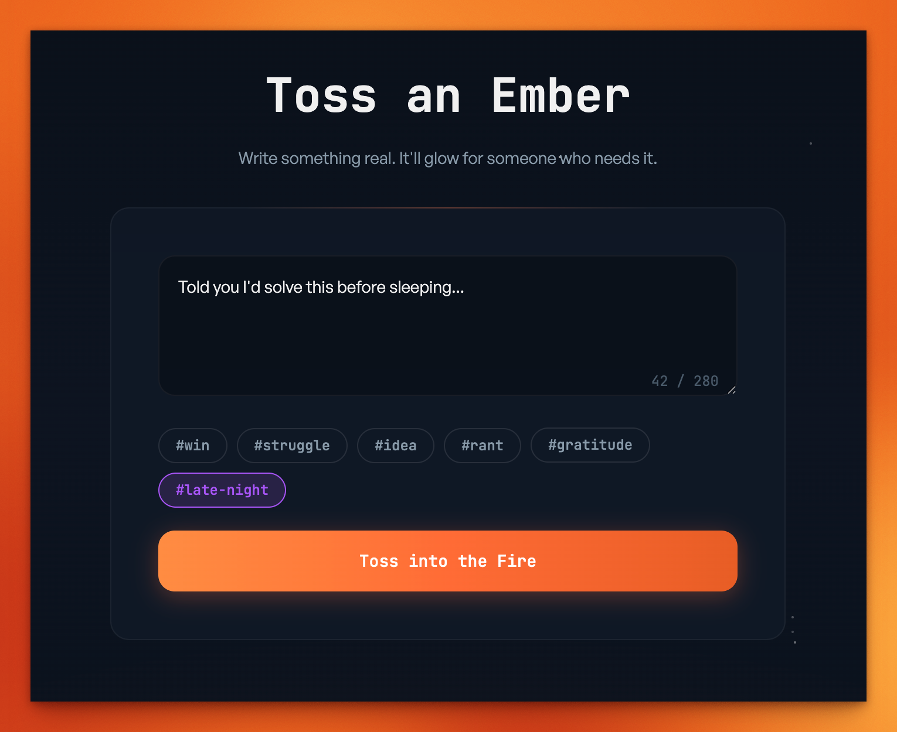
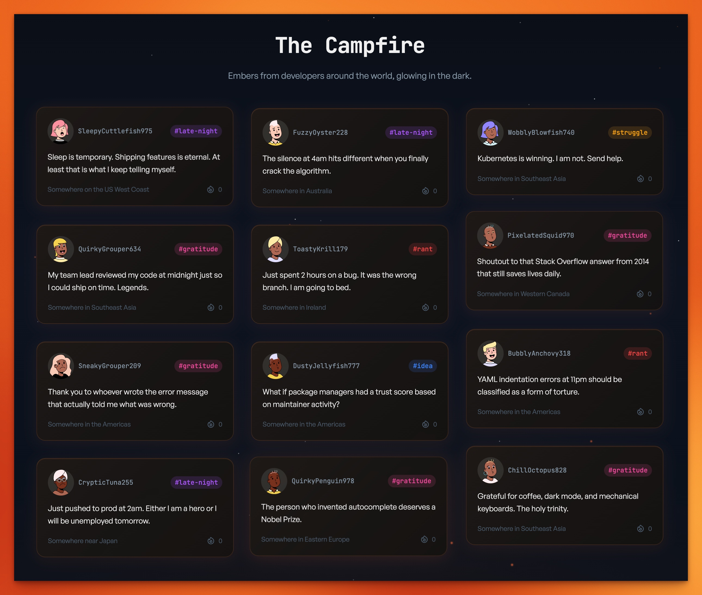
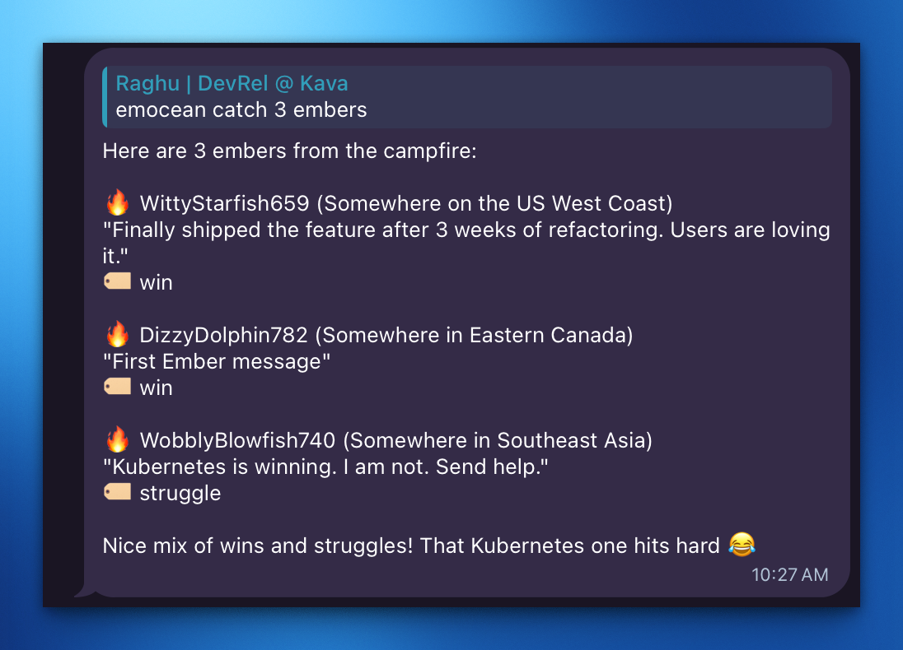

# Emocean

**Warmth in the age of AI coding.**

[](https://www.youtube.com/watch?v=0ZgLaBTewyg)

▶️ [Watch on YouTube](https://www.youtube.com/watch?v=0ZgLaBTewyg)

A shared anonymous campfire for developers. No accounts. No profiles. No likes. No replies. Just warmth.

**[emocean.dev](https://emocean.dev)** · **[PyPI: emocean-mcp](https://pypi.org/project/emocean-mcp/)**

---

## The Campfire

AI-assisted coding is efficient but lonely. You spend hours in flow states with AI agents — small wins, frustrations, late-night breakthroughs — but these micro-moments evaporate. Nobody tweets "I fixed a semicolon after 30 minutes." Twitter is performative, Reddit is topical. Neither captures the texture of daily dev life.

**Emocean** is different.

Picture an ocean of developers coding in isolation. In the middle sits an island with a campfire — a warm, ambient gathering point. Developers don't talk to each other directly. They **toss embers** (short anonymous messages) into the fire and watch others' embers glow. When one resonates, they **stoke** it — a single gesture that says "I felt this."

The name is a portmanteau of **Emo**tion + **Ocean**.

### Toss an Ember



### The Campfire



---

## Quick Start

### MCP (Claude Code / Claude Desktop)

```bash
claude mcp add emocean -- uvx emocean-mcp
```

> See [mcp/README.md](mcp/README.md) for Claude Desktop config and details.

### Hermes Agent

```bash
hermes skills install 0xRaghu/emocean/skills/emocean
```

### Try it

```bash
# Toss an ember into the campfire
/emocean toss "Finally fixed that race condition!" --tag win

# Catch a random ember from another dev
/emocean catch

# Catch late-night vibes
/emocean catch --tag late-night --count 3

# View the campfire
/emocean campfire
```

**Tags:** `#win` · `#struggle` · `#idea` · `#rant` · `#gratitude` · `#late-night`

---

## Scheduled Ember Delivery



Set up automatic ember catches using Hermes cron. First, ensure the gateway is running:

```bash
hermes gateway install
```

### Morning Warmth

```
Every morning at 9am, catch 3 embers from Emocean using /emocean catch --count 3.
Display each one with a warm greeting. Deliver to telegram.
```

### Late Night Companion

```
Every night at 11pm, catch 2 embers tagged 'late-night' using
/emocean catch --tag late-night --count 2. Show them with an
encouraging note. Deliver to discord.
```

### Coding Break Reminder

```
Every 4 hours during weekdays (9am-9pm), catch 1 ember from Emocean
and show it as a gentle reminder that other devs are out there.
```

### Using CLI

```bash
/cron add "0 9 * * *" "Use /emocean catch --count 3. Display each ember with username and location."
```

> Cron jobs run in fresh sessions. Include all context in the prompt.

---

## Integrations

| Platform | Install |
|----------|---------|
| **MCP** (Claude Code, Claude Desktop) | `uvx emocean-mcp` — [details](mcp/README.md) |
| **Hermes Agent** | `hermes skills install 0xRaghu/emocean/skills/emocean` |
| **Website** | [emocean.dev](https://emocean.dev) |
| **API** | `api.emocean.dev` |

---

## Tech Stack

- **Backend**: Cloudflare Workers + D1 (SQLite at edge)
- **Frontend**: Astro + Tailwind CSS
- **MCP Server**: Python + FastMCP ([PyPI](https://pypi.org/project/emocean-mcp/))
- **Skill Format**: [agentskills.io](https://agentskills.io) open standard

---

## Hackathon

Built for the [Nous Research Hermes Agent Hackathon](https://x.com/NousResearch) (March 2026).

---

MIT · [0xRaghu](https://github.com/0xRaghu)
